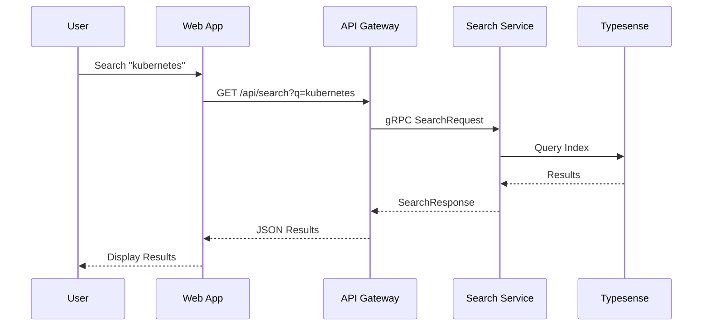
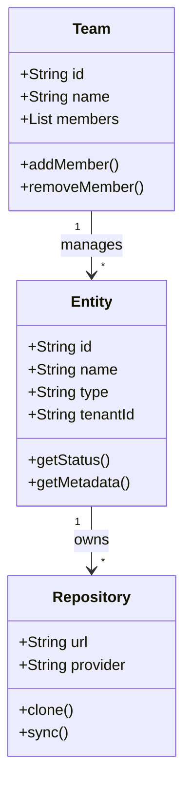
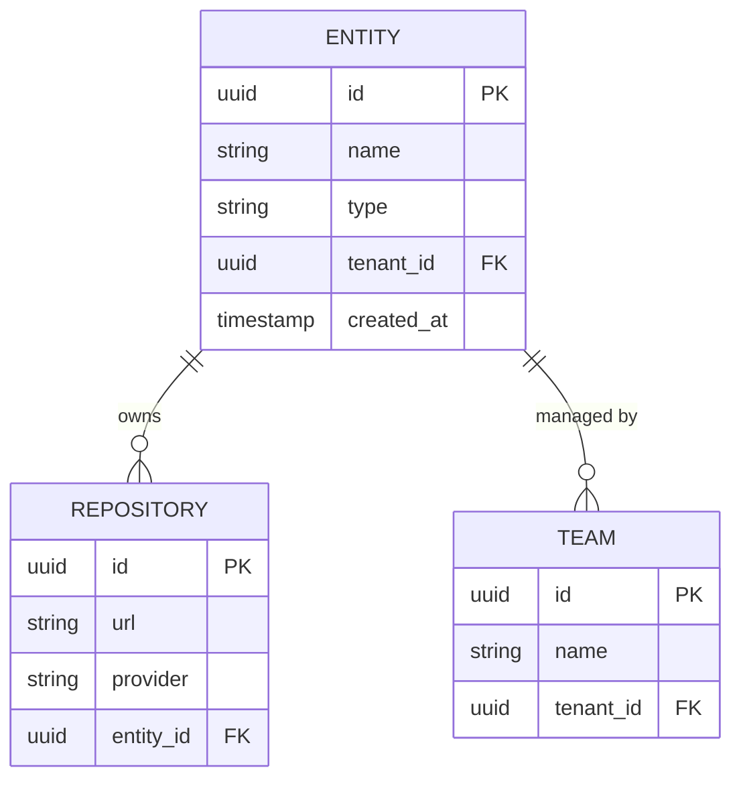
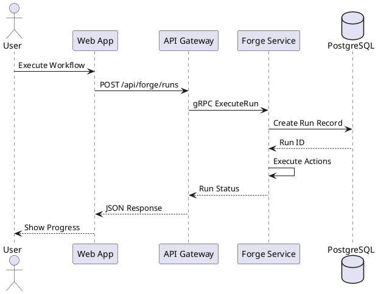
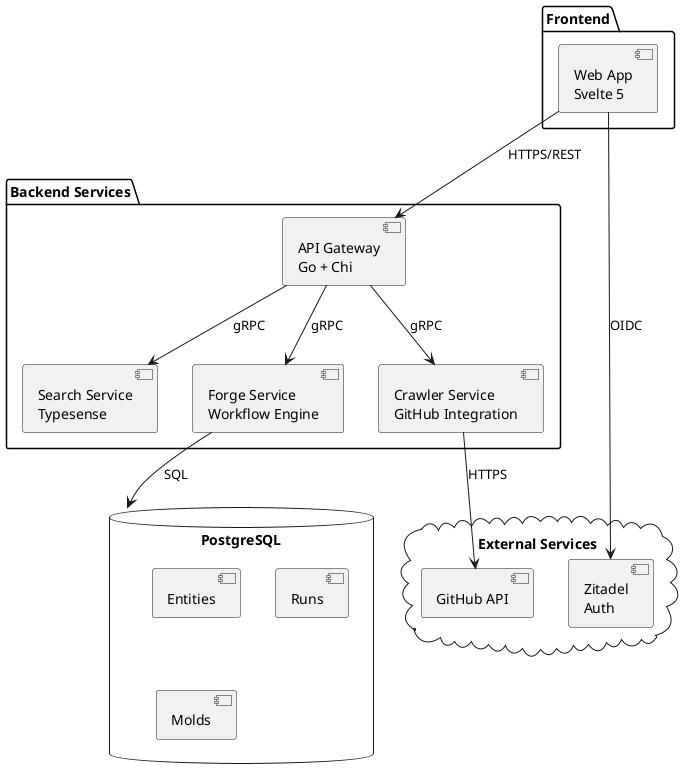
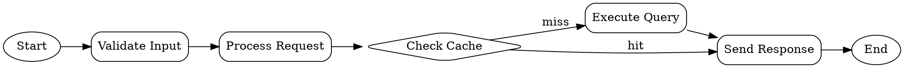

# Diagram Examples - All Supported Types

This document demonstrates all diagram types supported by the Shoehorn docs viewer.

## 1. PlantUML with C4 Model

C4 diagrams are supported via PlantUML with the C4-PlantUML library:

```uml
@startuml
!include https://raw.githubusercontent.com/plantuml-stdlib/C4-PlantUML/master/C4_Context.puml

title System Context - Online Shop

Person(customer, "Customer", "Buys products online.")
System(shop, "Online Shop", "Allows customers to browse and purchase products.")
System_Ext(payment, "Payment Provider", "Processes card payments.")
System_Ext(email, "Email Service", "Sends order confirmations.")

Rel(customer, shop, "Browses and purchases")
Rel(shop, payment, "Charges credit cards", "HTTPS")
Rel(shop, email, "Sends emails", "SMTP/API")

@enduml
```

## 2. Mermaid Flowchart

Mermaid diagrams render client-side for the best performance:

```mermaid
flowchart LR
  customer[Customer]

  subgraph shop[Online Shop System]
    web[Web App\nReact]
    api[API\nNode.js]
    db[(Database)\nPostgreSQL]
  end

  payment[Payment Provider\nExternal]
  email[Email Service\nExternal]

  customer -->|Uses HTTPS| web
  web -->|Calls HTTPS/JSON| api
  api -->|Reads/Writes| db
  api -->|Charges card| payment
  api -->|Sends confirmation| email
```

## 3. Mermaid Sequence Diagram

Perfect for API interactions:



## 4. Mermaid Class Diagram

Great for architecture documentation:



## 5. Mermaid Entity Relationship Diagram

Database schema visualization:



## 6. PlantUML Sequence Diagram

Alternative to Mermaid for sequence diagrams:



## 7. PlantUML Component Diagram

System architecture visualization:



## 8. GraphViz/DOT Diagram

Low-level graph visualization:



## 9. BlockDiag Diagram

Network and block diagrams:

```blockdiag
blockdiag {
    Web [color = "#77FF77"];
    API [color = "#7777FF"];
    Database [color = "#FF7777"];

    Web -> API -> Database;
    API -> Cache [style = dashed];
}
```

## 10. Sequence Diagram (SeqDiag)

Alternative sequence diagram format:

```seqdiag
seqdiag {
    User; WebApp; API; Database;

    User -> WebApp [label = "Click Search"];
    WebApp -> API [label = "GET /search"];
    API -> Database [label = "Query"];
    Database --> API [label = "Results"];
    API --> WebApp [label = "JSON"];
    WebApp --> User [label = "Display"];
}
```

## 11. Nomnoml Diagram

ASCII-art style diagrams:

```nomnoml
[<frame>Shoehorn Platform|
  [Web App]
  [API Gateway]
  [<database>PostgreSQL]
  [Search Service]
]

[User] -> [Web App]
[Web App] -> [API Gateway]
[API Gateway] -> [Search Service]
[API Gateway] -> [<database>PostgreSQL]
```

## 12. Math/LaTeX

Mathematical equations using KaTeX:

```math
f(x) = \int_{-\infty}^\infty \hat f(\xi)\,e^{2 \pi i \xi x} \,d\xi
```

```latex
\begin{aligned}
\nabla \times \vec{\mathbf{B}} -\, \frac1c\, \frac{\partial\vec{\mathbf{E}}}{\partial t} &= \frac{4\pi}{c}\vec{\mathbf{j}} \\
\nabla \cdot \vec{\mathbf{E}} &= 4 \pi \rho \\
\nabla \times \vec{\mathbf{E}}\, +\, \frac1c\, \frac{\partial\vec{\mathbf{B}}}{\partial t} &= \vec{\mathbf{0}} \\
\nabla \cdot \vec{\mathbf{B}} &= 0
\end{aligned}
```

## 13. BPMN Diagram

Business process modeling:

```bpmn
<?xml version="1.0" encoding="UTF-8"?>
<definitions xmlns="http://www.omg.org/spec/BPMN/20100524/MODEL">
  <process id="Process_1">
    <startEvent id="StartEvent_1"/>
    <task id="Task_1" name="Validate Request"/>
    <task id="Task_2" name="Process Data"/>
    <endEvent id="EndEvent_1"/>
    <sequenceFlow sourceRef="StartEvent_1" targetRef="Task_1"/>
    <sequenceFlow sourceRef="Task_1" targetRef="Task_2"/>
    <sequenceFlow sourceRef="Task_2" targetRef="EndEvent_1"/>
  </process>
</definitions>
```

## 14. Vega-Lite

Data visualization:

```vegalite
{
  "$schema": "https://vega.github.io/schema/vega-lite/v5.json",
  "description": "A simple bar chart with embedded data.",
  "data": {
    "values": [
      {"category": "A", "value": 28},
      {"category": "B", "value": 55},
      {"category": "C", "value": 43},
      {"category": "D", "value": 91}
    ]
  },
  "mark": "bar",
  "encoding": {
    "x": {"field": "category", "type": "nominal"},
    "y": {"field": "value", "type": "quantitative"}
  }
}
```

## Summary

The Shoehorn docs viewer now supports **20+ diagram types** out of the box:

### Client-Side Rendering (Fast)
- ✅ **Mermaid** - flowcharts, sequence, class, ER, state, gantt, journey, pie
- ✅ **Math/LaTeX** - mathematical equations via KaTeX

### Via Kroki API (Comprehensive)
- ✅ **PlantUML** - UML diagrams, C4 architecture, mind maps
- ✅ **C4-PlantUML** - C4 model diagrams
- ✅ **GraphViz/DOT** - directed graphs
- ✅ **BlockDiag family** - blockdiag, seqdiag, actdiag, nwdiag, packetdiag, rackdiag
- ✅ **BPMN** - business process modeling
- ✅ **Bytefield** - byte/bit field diagrams
- ✅ **Excalidraw** - hand-drawn style diagrams
- ✅ **Nomnoml** - ASCII art diagrams
- ✅ **Pikchr** - diagram scripting language
- ✅ **Structurizr** - software architecture diagrams
- ✅ **Svgbob** - ASCII art to SVG
- ✅ **Vega/Vega-Lite** - data visualizations
- ✅ **WaveDrom** - digital timing diagrams
- ✅ **Ditaa** - diagrams through ASCII art
- ✅ **Erd** - entity-relationship diagrams
- ✅ **D2** - modern declarative diagramming language

All diagrams support:
- 🎨 Dark/light theme switching
- 📋 Copy source to clipboard
- 💾 Download as SVG
- 🔍 Fullscreen mode
- ✏️ Open in external editor (for supported types)
