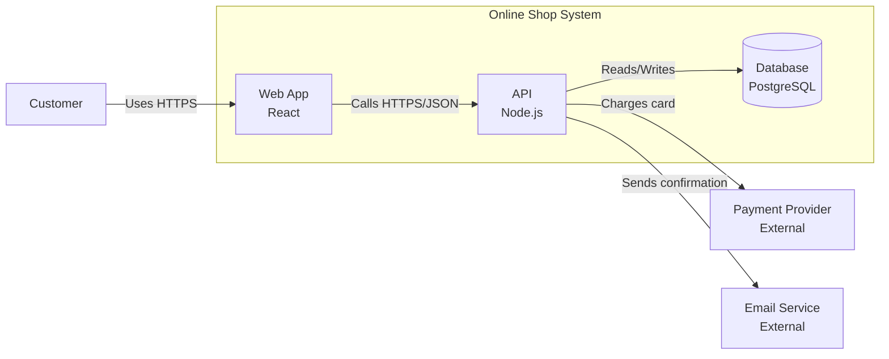
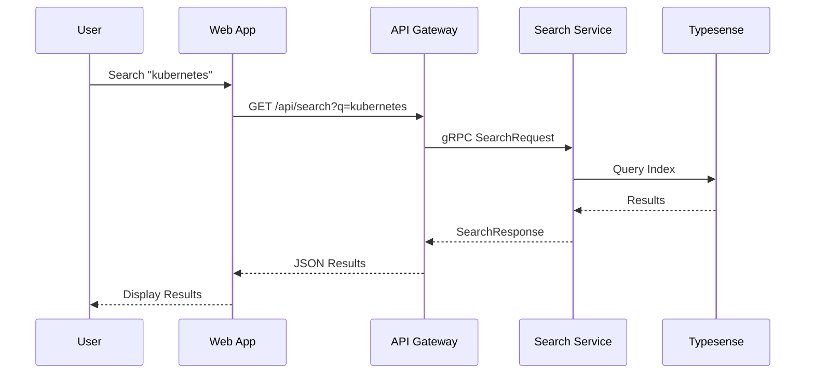
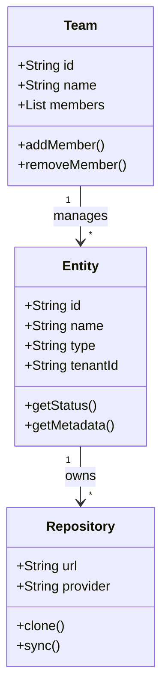
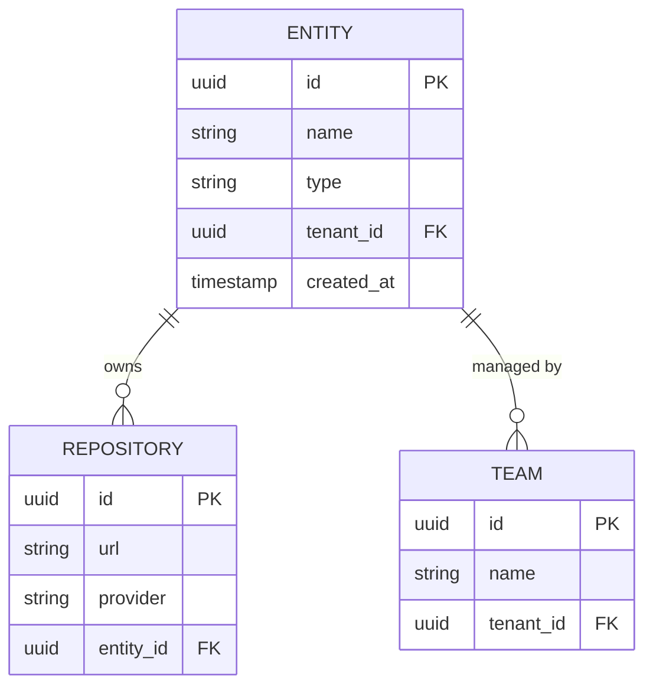
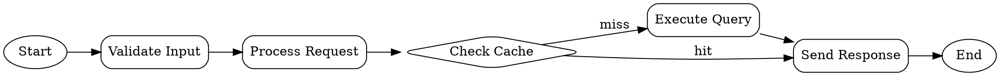

# Diagram Examples - All Supported Types

This document demonstrates all diagram types supported by the Shoehorn docs viewer.

## 1. Mermaid Flowchart

Mermaid diagrams render client-side for the best performance:



## 2. Mermaid Sequence Diagram

Perfect for API interactions:



## 3. Mermaid Class Diagram

Great for architecture documentation:



## 4. Mermaid Entity Relationship Diagram

Database schema visualization:



## 5. GraphViz/DOT Diagram

Low-level graph visualization:



## 6. Nomnoml Diagram

ASCII-art style diagrams:

```nomnoml
[<frame>Shoehorn Platform|
  [Web App]
  [API Gateway]
  [<database>PostgreSQL]
  [Search Service]
]

[User] -> [Web App]
[Web App] -> [API Gateway]
[API Gateway] -> [Search Service]
[API Gateway] -> [<database>PostgreSQL]
```

## 7. Math/LaTeX

Mathematical equations using KaTeX:

```math
f(x) = \int_{-\infty}^\infty \hat f(\xi)\,e^{2 \pi i \xi x} \,d\xi
```

```latex
\begin{aligned}
\nabla \times \vec{\mathbf{B}} -\, \frac1c\, \frac{\partial\vec{\mathbf{E}}}{\partial t} &= \frac{4\pi}{c}\vec{\mathbf{j}} \\
\nabla \cdot \vec{\mathbf{E}} &= 4 \pi \rho \\
\nabla \times \vec{\mathbf{E}}\, +\, \frac1c\, \frac{\partial\vec{\mathbf{B}}}{\partial t} &= \vec{\mathbf{0}} \\
\nabla \cdot \vec{\mathbf{B}} &= 0
\end{aligned}
```